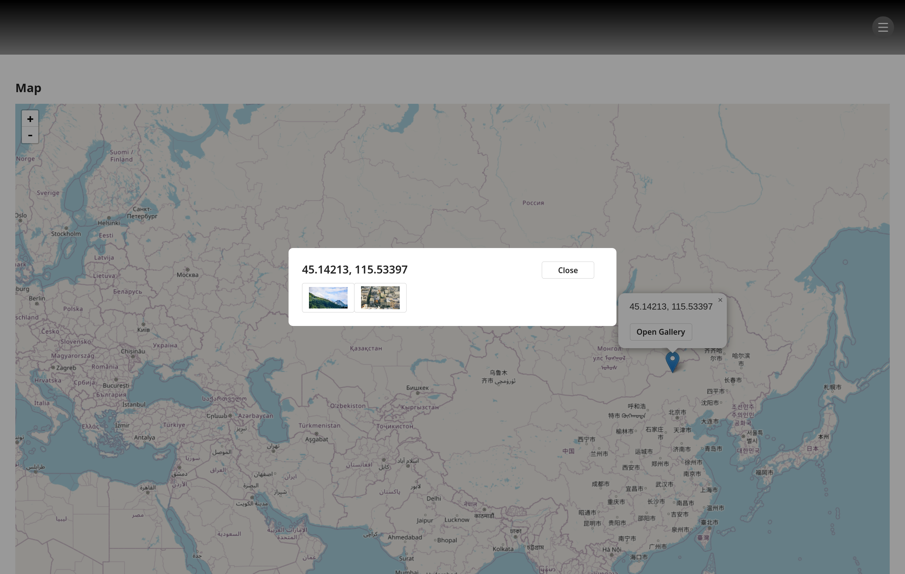
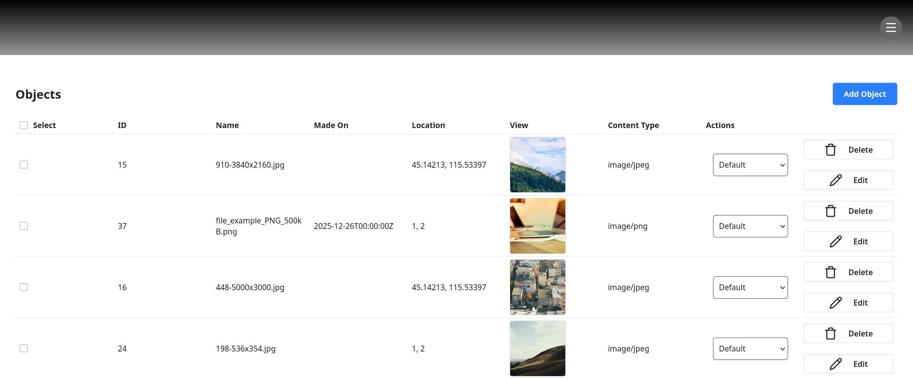
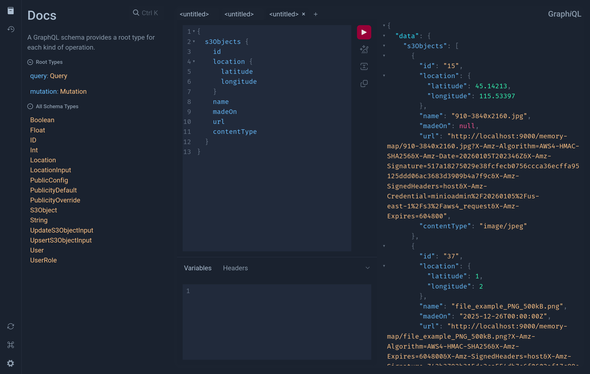

# Memory Map

Memory Map is a location-aware media archive that allows users to upload photos, videos, and audio files.

The list of supported file types is defined in the [allowed files list](https://github.com/nothingnesses/memory-map/blob/main/shared/src/lib.rs).

Time and location metadata are manually provided by users and are used to visualise uploaded media on an interactive world map.

Users can browse the map, click markers and explore media galleries tied to real-world locations - creating a digital memory atlas.

## Features

- Upload media files (images, videos and audio files).
- Manual location & timestamp tagging.
- Interactive world map with clickable memory pins.
- Gallery view for each map location.

## Screenshots

### Map View



### Gallery View


### Admin View



### GraphQL API (GraphiQL)



## Getting Started

### 1. Install dependencies

You'll need:

- [Nix Package Manager](https://nixos.org/download/)
- [nix-direnv](https://github.com/nix-community/nix-direnv?tab=readme-ov-file#installation)

### 2. Clone & enter project (you only need to do this step once)

```sh
git clone https://github.com/nothingnesses/memory-map.git
cd memory-map
```

### 3. Setup environment (you only need to do this step once)

```sh
cp .env.example .env
direnv allow
```

This installs all dependencies and auto-loads the development shell whenever you enter the directory.

You can optionally configure the build mode and other settings by editing `.env`:

- `BUILD_MODE="debug"` (default): Faster compilation, includes debug info.
- `BUILD_MODE="release"`: Optimised build, smaller binaries, slower compilation.
- Database, SMTP, and S3 storage configurations.
- Local storage uses `S3_ENDPOINT_URL`, `S3_ACCESS_KEY`, `S3_SECRET_KEY`,
  `S3_BUCKET_NAME`, `S3_REGION`, `S3_FORCE_PATH_STYLE`, and
  `S3_PRESIGNED_URL_TTL_SECONDS`.
- The default local S3 API endpoint is `http://127.0.0.1:9000/`, with region
  `us-east-1`, bucket `memory-map`, and path-style addressing enabled for
  RustFS. Presigned media URLs default to a seven-day lifetime.

### 4. Start database & storage

```sh
just servers
```

RustFS S3-compatible storage becomes available at: [http://localhost:9001/login](http://localhost:9001/login)

- **Username:** `memorymapdev`
- **Password:** `memorymapdevsecret`

### 5. Start backend

In another shell, run:

```sh
just backend
```

Backend GraphQL playground: [http://localhost:8000/](http://localhost:8000/)

### 6. Start frontend

In another shell, run:

```sh
just frontend
```

Frontend app: [http://localhost:3000/](http://localhost:3000/)

## Development Commands

The project uses [Just](https://github.com/casey/just) as a task runner.

- `just servers`: Start PostgreSQL and RustFS via Nix.
- `just clean-service-state`: Remove local PostgreSQL and storage service state.
- `just backend`: Start the Axum backend with hot-reloading (via Bacon).
- `just frontend`: Start the Leptos frontend (via Trunk).
- `just fmt`: Format Rust, Nix, Markdown, YAML, and TOML files.
- `just check`: Run `cargo check` for the workspace.
- `just clippy`: Run Clippy with warnings treated as errors.
- `just deny`: Check Rust dependencies with `cargo-deny`.
- `just doc`: Build documentation with warnings treated as errors and run ASCII/link checks.
- `just test`: Run the workspace test suite.
- `just storage-test`: Run ignored storage integration tests against the
  configured S3-compatible endpoint. Missing local storage skips by default; set
  `STORAGE_TEST_REQUIRE_SERVICE=true` to fail instead.
- `just frontend-build`: Build the frontend with Trunk.
- `just verify`: Run the full verification suite before submitting a PR.
- `just regenerate-schema`: Introspect the backend and update the frontend GraphQL schema.
- `just scan-hardcoded`: Scan the codebase for hardcoded secrets or values.

## Tech Stack

| Layer                   | Technology                                                |
| ----------------------- | --------------------------------------------------------- |
| Frontend                | [Leptos](https://leptos.dev/)                             |
|                         | [UnoCSS](https://unocss.dev/)                             |
| Backend                 | [Axum](https://github.com/tokio-rs/axum)                  |
|                         | [GraphQL](https://graphql.org)                            |
| Storage                 | [RustFS](https://rustfs.com/)                             |
| Database                | [PostgreSQL](https://www.postgresql.org)                  |
| Development Environment | [Nix package manager](https://nixos.org)                  |
|                         | [nix-direnv](https://github.com/nix-community/nix-direnv) |
| Task Runner             | [Just](https://github.com/casey/just)                     |

## Project Structure

```
memory-map/
|-- .direnv/         # Direnv environment cache
|-- backend/         # Axum and GraphQL backend
|-- data/            # Database and storage volumes
|-- devenv/          # Nix development environment
|-- frontend/        # Leptos and UnoCSS frontend
|-- shared/          # Shared utilities and types
|-- .env.example     # Environment configuration template
|-- justfile         # Development commands
|-- Cargo.toml       # Rust workspace configuration
|-- Cargo.lock       # Rust dependency lock file
`-- README.md        # Project documentation
```

## Contributing

We welcome contributions! Please ensure you run the verification suite before making a PR:

```sh
just verify
```

This command will:

- Format code and config
- Run workspace checks and Clippy
- Check dependency licenses and advisories
- Generate documentation
- Run tests
- Build the frontend

## License

This project is licensed under the [Blue Oak Model License 1.0.0](LICENSE).
